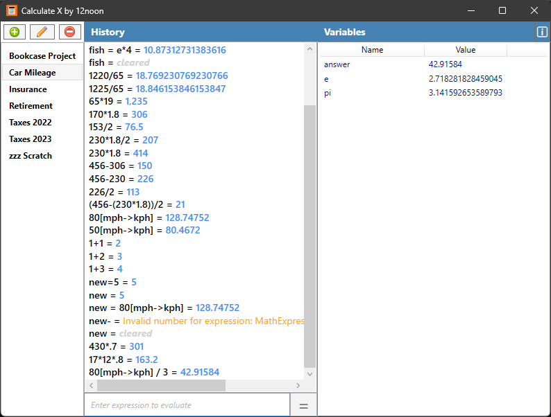

# Calculate X by [12noon LLC](https://12noon.com)

[](https://github.com/12noonLLC/CalculateX/actions/workflows/build-windows.yml)
[](https://github.com/12noonLLC/CalculateX/actions/workflows/build-maui.yml)

[](https://github.com/12noonLLC/CalculateX/releases/latest)

[](https://github.com/12noonLLC/CalculateX)

A calculator that evaluates math expressions.

<a href="https://apps.microsoft.com/store/detail/9NWLKMVZPJD3?launch=true&mode=full">
	
</a>



## Features

### Summary
- Evaluates math expressions including grouping.
- Create multiple workspaces with their own history and variables.
- Set variables including recent answer.
- Supports trigonometry and other functions.
- Converts common units of:
    - Distance
    - Speed
    - Temperature
    - Time
    - Volume
    - Mass

Enter simple or complex mathematical expressions and immediately calculate the result.
From adding your grocery bill to calculating volume to doing your taxes, *Calculate X* does it all.
It also converts units of distance, speed, temperature, time, volume, and mass.
Create multiple workspaces with their own history and variables that are automatically saved and restored.
Results are added to history, so you don't have to write them down to remember them.
Those results are even saved and restored when you exit and restart the application.

### Usage

Type an expression in the input field and press **Enter** or press the ` = ` button.

If the first character you enter in the input field is an operator (*e.g.,* + or /),
Calculate X will automatically prefix it with the "answer" variable.

````
answer+
````

**Windows:** Press **ESC** to clear the input field.
**Android:** Tap the **"x"** in the input field to clear it.

Select a previous expression to copy it to the input field where you can edit it.
This will also copy the result of the expression to the clipboard,
so that you can paste it into another application.

### Workspaces

You can create multiple workspaces in Calculate X.
Each workspace has its own input history and variables.

You can use workspaces to separate different calculation tasks.
Use one for working on your taxes, another for adding your utility bills,
and another for measuring the wood to build bookcases.

#### Windows

Press the plus button to add a new workspace.

Press the pencil button to rename the current workspace.

Press the delete button to delete the current workspace.

| Key | Action |
|-----|--------|
| Ctrl+T | Create new workspace |
| Ctrl+W | Close current workspace |
| Ctrl+F4 | Close current workspace |
| Ctrl+PageUp | Select previous workspace |
| Ctrl+PageDown | Select next workspace |
| Ctrl+Shift+Tab | Select previous workspace |
| Ctrl+Tab | Select next workspace |

#### Android

Select the **Rename** command in the overflow menu to rename the current workspace.

Select the **Delete** command in the overflow menu to delete the current workspace.

### Basic Mathematical Operators

*Calculate X* supports the basic mathematical operators: addition, subtraction,
multiplication, division, modulo, and exponent.
You can use parentheses to group expressions and give them precedence.

- addition: `+`
- subtraction: `-`
- multiplication: `*`
- division: `/`
- modulo: `%`
- exponent: `^`

Example: `(3 + 4)*(5 - 2) * (sin(68) / sqrt(25)) + max(16, 7) ^ 2`

You can also use algebraic (implied) multiplication in many cases:

- Between groups: `(3 + 4)(5 - 2)`
- Before and after groups: `-17(9 / 3)42`
- Before and after functions: `23sqrt(9)ceiling(25 / 2)12`
- Between groups and functions: `(4 + 3)sqrt(9)(12 / 2)`
- Between groups and variables: `(4 + 3)e(12 / 2)`
- Before variables: `4pi`

### Variables

You can create variables and access them in your expressions.
Variables can contain letters, digits, and underscores, but they must start with a letter.
All variables and their current values are displayed in a list on the right.
Select a variable in the list to copy its name into the input field.
This will also copy the value of the variable to the clipboard,
so that you can paste it into another application.

Examples:
````
x = 23.68
y2 = sqrt(146)
x2y = x * y2
result = 12 + 8.4
subtotal3 = result - x2y + 87
````

The `pi` and `e` variables are pre-defined.
The `answer` variable always equals the most recent result.

Examples:
````
y = sin(pi / 2)
y2 = asin(2pi)
x = y + 2
x + 1
````
(The result is `4` and the `answer` variable is automatically set to `4`.)

📌 If you type an operator into an empty input field,
it automatically enters "*answer*" in the field for you.

You can clear a variable (and remove it from the variable pane) by setting it to nothing.

````
x =
````

### Basic Functions

- sqrt(n) - square root of `n`
- cbrt(n) - cube root of `n`
- abs(n) - absolute value of `n`
- pow(n, x) - `n` to the power of `x`
- min(a, b) - smallest of `a` and `b`
- max(a, b) - largest of `a` and `b`
- round(d, n) - `d` rounded to `n` decimal places
- truncate(d) - `d` without decimal portion
- floor(n) - largest integer smaller than `n`
- ceiling(n) - smallest integer larger than `n`
- random1() - random number `r` less than 1 (0 <= r < 1)
- randomN(n) - random number `r` between 0 and `n` (0 <= r < n)

### Trigonometric Functions

- cos(t) - cosine of `t`
- cosh(t) - hyperbolic cosine of `t`
- acos(t) - arccosine of `t`
- sin(t) - sine of `t`
- sinh(t) - hyperbolic sine of `t`
- asin(t) - arcsine of `t`
- tan(t) - tangent of `t`
- tanh(t) - hyperbolic tangent of `t`
- atan(t) - arctangent of `t`
- atanh(t) - hyperbolic arctangent of `t`
- atan2(x,y) - arctangent of `x/y`

### Logarithmic Functions

- exp(x) - `e` to the power of `x`
- log(n) - log base `e` of `n`
- log10(n) - log base 10 of `n`
- log2(n) - log base 2 of `n`

### Conversion Functions

To convert between two units, use this format:

`n[from->to]`

Example: `80[kph->mph]`

#### length

- Kilometer `km`
- Meter `m`
- Centimeter `cm`
- Millimeter `mm`
- Mile `mile`
- Yard `yd`
- Feet `ft`
- Inch `in`

#### speed

- Kilometers/hour `kph`
- Meters/second `m/s`
- Miles/hour `mph`
- Feet/second `ft/s`
- Knot `knot` (nautical-miles/hour)
- Mach `mach` (speed of sound)

#### temperature

- Fahrenheit `f`
- Celsius `c`
- Kelvin `k`

#### time

- Week `wk`
- Day `d`
- Hour `hr`
- Minute `min`
- Second `sec`
- Millisecond `ms`

#### mass

- Kilogram `kg`
- Gram `g`
- Milligram `mg`
- Ton `ton`
- Pound `lb`
- Ounce `oz`

#### volume

- Kiloliter `kl`
- Liter `l`
- Milliliter `ml`
- Gallon `gal`
- Quart `qt`
- Pint `pt`
- Cup `cup`
- Ounce `oz`

------------

## Save File

*Calculate X* saves the workspaces in your *Documents* folder in a file called `CalculateX.xml`.

If you are familiar with XML, you can exit *Calculate X* and edit this file
to modify, add, or remove calculations.

If you use cloud storage, such as OneDrive or DropBox,
you can synchronize this file between multiple computers.
At the moment, *Calculate X* only opens the file when it starts
and does not detect changes in the file while it is running.
This means it is possible that it will overwrite changes made on
another computer and synchronized while it is running.
Therefore, it is recommended that you close *Calculate X* when you are done using your computer.

------------

## MathExpressions Library

The library supports mathematical expressions, functions, unit conversion, and variables.

Below are some C# examples of using the library directly.

````C#
MathEvaluator eval = new();
//basic math
double result = eval.Evaluate("(2 + 1) * (1 + 2)");
//calling a function
result = eval.Evaluate("sqrt(4)");
//evaluate trigonometric 
result = eval.Evaluate("cos(pi * 45 / 180.0)");
//convert inches to feet
result = eval.Evaluate("12 [in->ft]");
//use variable
result = eval.Evaluate("answer * 10");
//add variable
eval.Variables.Add("x", 10);
result = eval.Evaluate("x * 10");
````

------------

*This project was originally forked from [Calculator.NET](https://github.com/loresoft/Calculator).*
